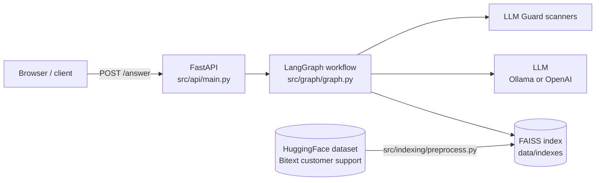
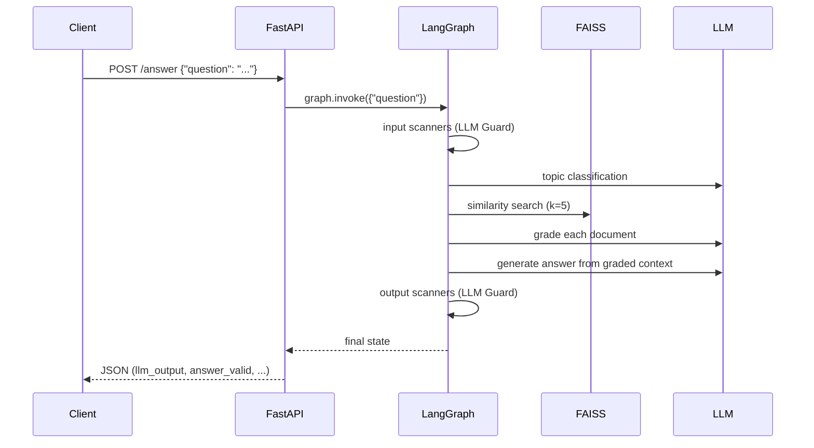

# Customer Support Agentic RAG

A customer-support Q&A service built on **LangGraph**. Questions pass through input guardrails and a topic filter, get answered from a **FAISS** index of real support conversations, and the answer is checked by output guardrails before it's returned.

Stack: FastAPI · LangGraph / LangChain · FAISS · HuggingFace embeddings (`all-MiniLM-L6-v2`) · Ollama (default) or OpenAI · LLM Guard · Polars · ragas · Docker Compose.

## Architecture

## Workflow

Three input scanners run in parallel. If they pass, the question is checked for topic, matching Q&A pairs are retrieved and graded, and an answer is generated. Three output scanners then run in parallel before the answer is accepted.

The graph state (`src/graph/state.py`) holds `question`, `question_status`, `question_valid`, `on_topic`, `documents`, `prompt`, `llm_output`, `answer_status` and `answer_valid`. The status lists use an `add` reducer, so results from the parallel scanners are merged.

## Request lifecycle

