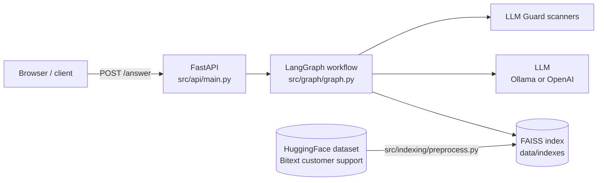

# Customer Support Agentic RAG

A customer-support Q&A service built on **LangGraph**. Questions pass through input guardrails and a topic filter, get answered from a **FAISS** index of real support conversations, and the answer is checked by output guardrails before it's returned.

Stack: FastAPI · LangGraph / LangChain · FAISS · HuggingFace embeddings (`all-MiniLM-L6-v2`) · Ollama (default) or OpenAI · LLM Guard · Polars · ragas · Docker Compose.

## Architecture

