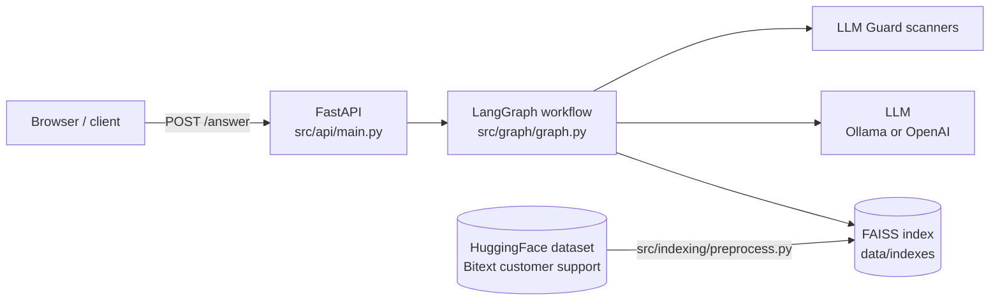
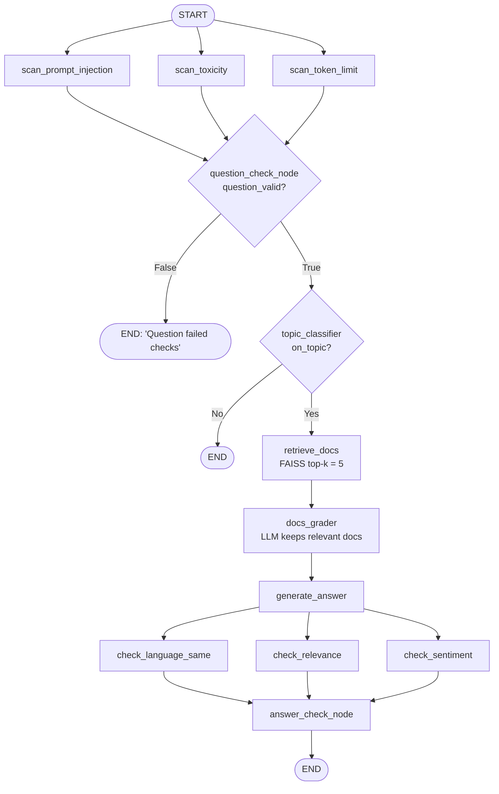
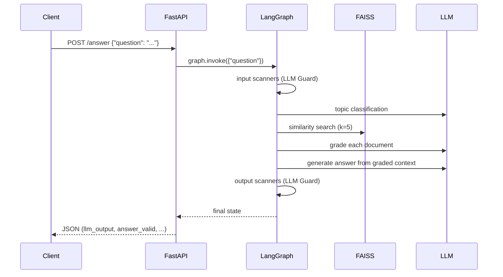
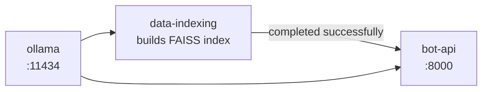

# Customer Support Agentic RAG

A customer-support Q&A service built on **LangGraph**. Questions pass through input guardrails and a topic filter, get answered from a **FAISS** index of real support conversations, and the answer is checked by output guardrails before it's returned.

Stack: FastAPI · LangGraph / LangChain · FAISS · HuggingFace embeddings (`all-MiniLM-L6-v2`) · Ollama (default) or OpenAI · LLM Guard · Polars · ragas · Docker Compose.

## Architecture



## Workflow

Three input scanners run in parallel. If they pass, the question is checked for topic, matching Q&A pairs are retrieved and graded, and an answer is generated. Three output scanners then run in parallel before the answer is accepted.



The graph state (`src/graph/state.py`) holds `question`, `question_status`, `question_valid`, `on_topic`, `documents`, `prompt`, `llm_output`, `answer_status` and `answer_valid`. The status lists use an `add` reducer, so results from the parallel scanners are merged.

## Request lifecycle



## Indexing

`src/indexing/preprocess.py` downloads the Bitext dataset, renames `instruction`/`response` to `question`/`answer` and drops nulls. It then embeds each question as a document (keeping the Q&A pair as metadata) and writes the FAISS index to `data/indexes/faiss_index.faiss`. If the index already exists, only new document IDs are added.

## Project structure

```
src/
├── config.py              # pydantic-settings; all tunables live here
├── api/                   # FastAPI app + static web UI (index.html, script.js, styles.css)
├── graph/                 # LangGraph nodes, state, and workflow wiring
├── indexing/preprocess.py # dataset download + FAISS index build
└── evaluation/evalute_rag.py  # ragas evaluation
data/                      # FAISS index (generated)
evaluation_results/        # ragas HTML reports
```

## Setup

Requires Python 3.12 and [uv](https://docs.astral.sh/uv/) (or pip with `requirements.txt`), plus [Ollama](https://ollama.com/) for local inference.

```bash
uv sync
cp .env.example .env              # add OPENAI_API_KEY if using OpenAI / evaluation
ollama pull llama3.2:3b           # must match OLLAMA_MODEL_NAME in src/config.py
```

### Configuration

Settings live in `src/config.py`, and any of them can be overridden from `.env`:

| Setting | Default | Purpose |
|---|---|---|
| `OLLAMA_MODEL_NAME` | `llama3.2:3b` | Local LLM |
| `LLM_MODEL_NAME` | `gpt-4o-mini` | OpenAI model when `local_llm=False` |
| `LLM_MAX_TOKENS` | `100` | Max answer length for Ollama |
| `EMBEDDINGS_MODEL_NAME` | `sentence-transformers/all-MiniLM-L6-v2` | Embeddings |
| `FAISS_TOP_K` | `5` | Retrieved documents |
| `EVALUATION_SAMPLE_SIZE` | `10` | ragas sample size |
| `LANGCHAIN_API_KEY`, `LANGCHAIN_TRACING_V2`, `LANGCHAIN_PROJECT` | — | Optional LangSmith tracing |

## Running

```bash
# 1. Build the index
uv run python -m src.indexing.preprocess

# 2. Start the API + web UI at http://localhost:8000
uv run uvicorn src.api.main:app --reload

# 3. Ask a question
curl -X POST localhost:8000/answer -H 'Content-Type: application/json' \
     -d '{"question": "I want to return a package"}'
```

| Endpoint | Method | Description |
|---|---|---|
| `/` | GET | Chat web UI |
| `/answer` | POST | `{"question": str}` → final graph state as JSON |
| `/health` | GET | `{"status": "ok"}` |

### Docker Compose



```bash
docker compose up --build
```

