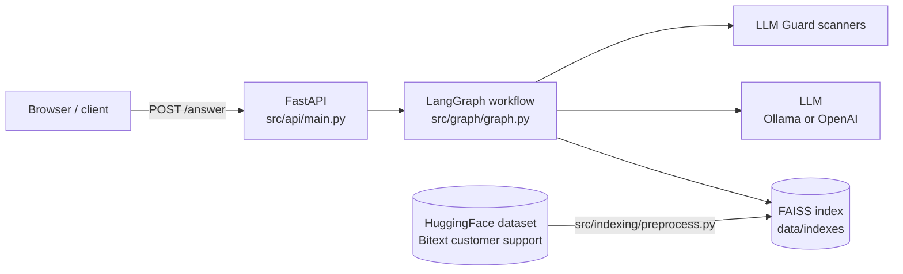
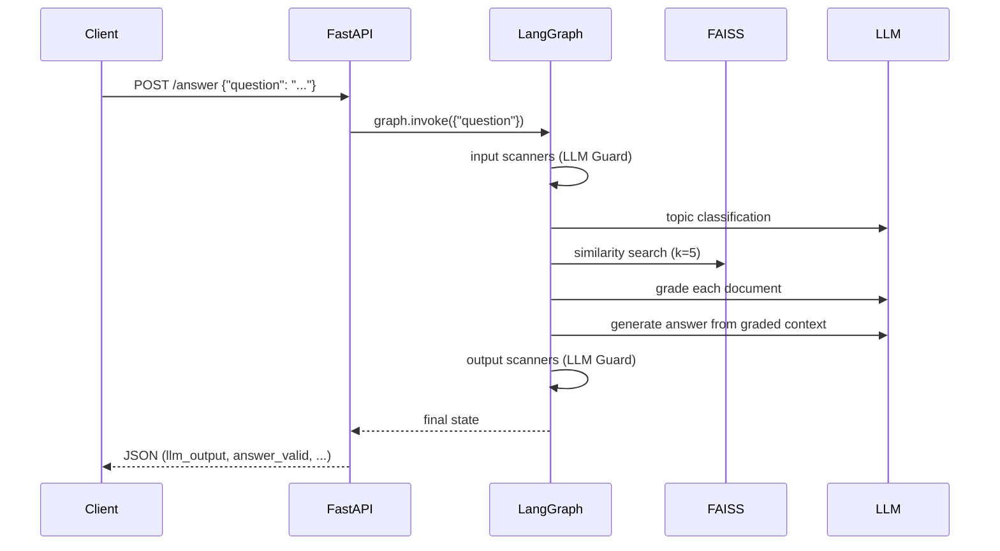
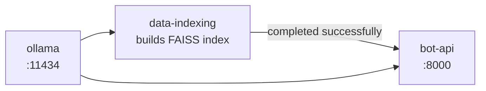

# Customer Support Agentic RAG

A customer-support Q&A service built on **LangGraph**. Questions pass through input guardrails and a topic filter, get answered from a **FAISS** index of real support conversations, and the answer is checked by output guardrails before it's returned.

Stack: FastAPI · LangGraph / LangChain · FAISS · HuggingFace embeddings (`all-MiniLM-L6-v2`) · Ollama (default) or OpenAI · LLM Guard · Polars · ragas · Docker Compose.

## Architecture


```mermaid
flowchart LR
    U[Browser / client] -->|POST /answer| API[FastAPI<br/>src/api/main.py]
    API --> G[LangGraph workflow<br/>src/graph/graph.py]
    G --> F[(FAISS index<br/>data/indexes)]
    G --> L[LLM<br/>Ollama or OpenAI]
    G --> LG[LLM Guard scanners]
    HF[(HuggingFace dataset<br/>Bitext customer support)] -->|src/indexing/preprocess.py| F
```

## Workflow

Three input scanners run in parallel. If they pass, the question is checked for topic, matching Q&A pairs are retrieved and graded, and an answer is generated. Three output scanners then run in parallel before the answer is accepted.

```mermaid
flowchart TD
    S([START]) --> PI[scan_prompt_injection]
    S --> TX[scan_toxicity]
    S --> TL[scan_token_limit]
    PI & TX & TL --> QC{question_check_node<br/>question_valid?}
    QC -- False --> E1([END: 'Question failed checks'])
    QC -- True --> RT{router<br/>intent?}
    RT -- OFF_TOPIC --> E2([END: decline])
    RT -- ORDER --> OS[order_status<br/>get_order_status tool → SQLite]
    OS --> E4([END])
    RT -- REFUND --> RC{refund_check<br/>eligible?}
    RC -- No --> E5([END: reason])
    RC -- Yes --> HA[[human_approval<br/>interrupt: graph pauses]]
    HA -- approved --> PR[process_refund<br/>mock tool → SQLite]
    HA -- rejected --> RR[refund_rejected]
    PR & RR --> E6([END])
    RT -- FAQ --> R[retrieve_docs<br/>hybrid BM25+FAISS + rerank, top 5]
    R --> DG[docs_grader<br/>LLM keeps relevant docs (batched)]
    DG --> GA[generate_answer]
    GA --> LS[check_language_same]
    GA --> RL[check_relevance]
    GA --> SE[check_sentiment]
    LS & RL & SE --> AC[answer_check_node]
    AC --> E3([END])
```

The graph state (`src/graph/state.py`) holds `question`, `question_status`, `question_valid`, `intent`, `order_id`, `order`, `refund_eligible`, `refund_reason`, `refund_approved`, `refund`, `documents`, `llm_output`, `answer_status` and `answer_valid`. The status lists use an `add` reducer, so results from the parallel scanners are merged.

## Request lifecycle


```mermaid
sequenceDiagram
    participant C as Client
    participant A as FastAPI
    participant W as LangGraph
    participant V as FAISS
    participant M as LLM
    C->>A: POST /answer {"question": "..."}
    A->>W: graph.invoke({"question"})
    W->>W: input scanners (LLM Guard)
    W->>M: topic classification
    W->>V: similarity search (k=5)
    W->>M: grade each document
    W->>M: generate answer from graded context
    W->>W: output scanners (LLM Guard)
    W-->>A: final state
    A-->>C: JSON (llm_output, answer_valid, ...)
```

## Router and order tool

`router` makes one structured-output LLM call that returns `intent` (`FAQ`, `ORDER`, `REFUND`, `OFF_TOPIC`) and an optional `order_id`. FAQ goes through the RAG chain; ORDER calls the `get_order_status` tool (`src/orders/db.py`), which reads a local SQLite DB (`data/orders.db`) seeded with synthetic orders 1042–1047 on first use. Order replies are templates over DB fields, so they skip the output scanners.

## Refund flow

Three separate steps, all on synthetic data (no payment API):

1. **Eligibility** (`refund_check`): looks up the order with `get_order_status` and applies `check_refund_eligibility` (`src/orders/refunds.py`): only orders delivered within the last 30 days and not already refunded qualify. No side effects.
2. **Human approval** (`human_approval`): calls LangGraph `interrupt()`, so the graph stops and checkpoints (in-memory `MemorySaver` in the API). `/answer` returns `pending_approval` and a `thread_id`; a support agent resumes it with `POST /approve`.
3. **Execution** (`process_refund`): the only code that refunds. The mock tool re-checks eligibility, inserts a `refunds` row (one per order, `UNIQUE`) and marks the order `refunded`. A rejection runs `refund_rejected` instead and changes nothing.

```bash
curl -X POST localhost:8000/answer -H 'Content-Type: application/json' -d '{"question": "Can I get a refund for order 1042?"}'
# → "...waiting for approval by a support agent", pending_approval {...}, thread_id
curl -X POST localhost:8000/approve -H 'Content-Type: application/json' -d '{"thread_id": "<thread_id>", "approved": true}'
# → "Your refund of ₹24,999 for order 1042 has been processed. Reference: RF-00001."
```

Delete `data/orders.db` to reset the demo data. Seed dates are fixed, so order 1042 falls outside the 30-day window after 2026-10-23.

## Indexing

`src/indexing/preprocess.py` downloads the Bitext dataset, renames `instruction`/`response` to `question`/`answer` and drops nulls. It shuffles (seeded) and holds out `TEST_FRACTION` of rows as `data/test.csv`, dropping any test question whose exact text is also in train. Only the train split is embedded (question as document, Q&A pair as metadata) into `data/indexes/faiss_index.faiss`; the index is rebuilt on every run.

## Project structure

```
src/
├── config.py              # pydantic-settings; all tunables live here
├── api/                   # FastAPI app + static web UI (index.html, script.js, styles.css)
├── graph/                 # LangGraph nodes, state, and workflow wiring
├── indexing/preprocess.py # dataset download + FAISS index build
└── evaluation/evaluate_rag.py # ragas evaluation on held-out split
data/                      # FAISS index + held-out test.csv (generated)
evaluation_results/        # ragas HTML reports
```

## Setup

Requires Python 3.12 and [uv](https://docs.astral.sh/uv/) (or pip with `requirements.txt`), plus [Ollama](https://ollama.com/) for local inference.

```bash
uv sync
cp .env.example .env              # set LLM_MODEL + the provider's API key
ollama pull llama3.2:3b           # only if LLM_MODEL=ollama:...
```

### Configuration

Settings live in `src/config.py`, and any of them can be overridden from `.env`:

| Setting | Default | Purpose |
|---|---|---|
| `LLM_MODEL` | `ollama:llama3.2:3b` | `provider:model` for `init_chat_model`, e.g. `openai:gpt-4o-mini`, `groq:llama-3.1-8b-instant` |
| `LLM_MAX_TOKENS` | `300` | Max answer length |
| `EVALUATION_LLM_MODEL` | `openai:gpt-4o-mini` | ragas judge |
| `TEST_FRACTION` | `0.05` | Held-out share, never indexed |
| `EMBEDDINGS_MODEL_NAME` | `sentence-transformers/all-MiniLM-L6-v2` | Embeddings |
| `FAISS_TOP_K` | `5` | Retrieved documents |
| `RETRIEVAL_MODE` | `hybrid_rerank` | `faiss` (baseline), `hybrid` (BM25 + FAISS, RRF), `hybrid_rerank` (+ cross-encoder) |
| `CANDIDATE_K` | `20` | Candidates per retriever before fusion / rerank |
| `RERANKER_MODEL_NAME` | `BAAI/bge-reranker-base` | Cross-encoder reranker |
| `EVALUATION_SAMPLE_SIZE` | `30` | ragas sample size |
| `LANGCHAIN_API_KEY`, `LANGCHAIN_TRACING_V2`, `LANGCHAIN_PROJECT` | — | Optional LangSmith tracing |

## Running

```bash
# 1. Build the index
uv run python -m src.indexing.preprocess

# 2. Start the API + web UI at http://localhost:8000
uv run uvicorn src.api.main:app --reload

# 3. Ask a question
curl -X POST localhost:8000/answer -H 'Content-Type: application/json' \
     -d '{"question": "I want to return a package"}'
```

| Endpoint | Method | Description |
|---|---|---|
| `/` | GET | Chat web UI |
| `/answer` | POST | `{"question": str}` → `{llm_output, question_valid, intent, order, refund, answer_valid, thread_id, pending_approval}` |
| `/approve` | POST | `{"thread_id": str, "approved": bool}` → resumes a paused refund; 404 if nothing is pending |
| `/health` | GET | `{"status": "ok"}` |

### Docker Compose


```mermaid
flowchart LR
    O[ollama<br/>:11434] --> I[data-indexing<br/>builds FAISS index]
    I -- completed successfully --> B[bot-api<br/>:8000]
    O --> B
```

```bash
docker compose up --build
```

### Evaluation

Router on a hand-labeled set of 48 questions (`evaluation_data/router_eval.json`, 12 per intent, 19 with order IDs), run sequentially with retry/backoff:

```bash
uv run python -m src.evaluation.evaluate_router   # writes evaluation_results/router_eval_{summary,predictions}.json
```

With `groq:openai/gpt-oss-120b`: 47/48 correct (FAQ 11/12, ORDER, REFUND, OFF_TOPIC 12/12), order ID exact match 19/19, no IDs invented for the 29 questions without one; two runs gave identical predictions. The miss: "How can I change the shipping address on order 1044?" (labeled FAQ) was routed to ORDER. The set is small and written by the developers, so treat this as a sanity check, not a benchmark.

Retrieval modes on the held-out split (hit = a retrieved pair shares the test question's intent):

```bash
uv run python -m src.evaluation.evaluate_retrieval   # writes evaluation_results/retrieval_modes.csv
```

| Mode | n | intent hit@1 | intent hit@5 | MRR@5 | ms/query (CPU) |
|---|---|---|---|---|---|
| faiss | 1169 | 0.9932 | 0.9991 | 0.9959 | 11.4 |
| hybrid | 1169 | 0.9897 | 1.0000 | 0.9937 | 82.8 |
| hybrid_rerank | 1169 | 0.9923 | 0.9991 | 0.9954 | 1078.3 |

Held-out questions are paraphrases of indexed ones, so all modes sit at the ceiling. Where the
upgrade shows is out-of-vocabulary wording: the dataset has no "return" questions, and for
"I want to return a package, how do I do that?" FAISS retrieves only `delivery_period` pairs
(bot hands off to a human), while `hybrid_rerank` surfaces a `get_refund` pair and the bot answers.


```bash
uv run python -m src.evaluation.evaluate_rag   # needs the judge model's API key
```

This samples held-out questions (never indexed), runs them through the graph, and scores the answers with ragas (Faithfulness, FactualCorrectness, LLMContextRecall). HTML reports are written to `evaluation_results/`.

## Known issues

- Output `Sentiment` scanner may reject apologetic support answers.
- Every request still makes several sequential LLM calls (topic, grading batch, answer).
